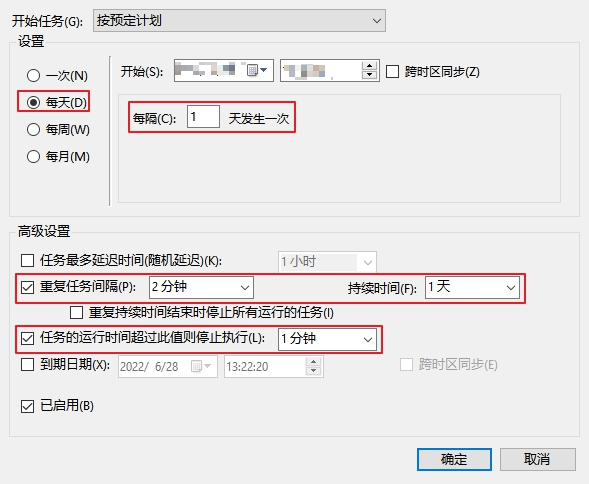

## 随机DNS服务器更换工具
适合DNS服务器被污染的情况。

### 说明
1. 配合windows计划任务使用可以实现定时更换
2. 需要win7以上操作系统支持（支持超过2个以上的dns服务器设置）
3. dns.txt可以包含任意数量dns服务器地址，每次随机排序设置多个dns服务器
4. 使用windows计划任务是需要使用最高权限运行
    
    
(计划任务配置)
 

    
    
(触发器配置)
 
5. 使用vbs脚本可以避免弹出命令行对话框